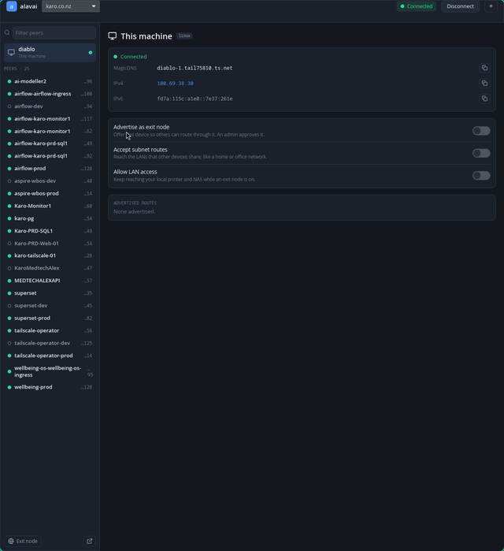

# alavai

A lightweight, distro-agnostic **Tailscale client for Linux**, with **one-click
tailnet switching** built in from the start. Written in Rust — a single
self-contained binary, no GTK/Qt system dependencies, at home in any desktop
environment or window manager.

[](https://github.com/alex-poor/alavai/actions/workflows/ci.yml)
[](LICENSE)
[](https://www.rust-lang.org/)
[](CONTRIBUTING.md)

> Status: **early but functional.** The system tray and main window are usable
> today — see [Features](#features). A few features that depend on tailnet
> settings we couldn't test against (Taildrop, Mullvad) are scoped but not yet
> built. Roadmap and progress: [docs/PLAN.md](docs/PLAN.md).



## Why

There's no official Tailscale GUI for Linux. alavai is a native, pure-Rust one
built to be **lightweight and universal** — a single binary that's at home on any
distro and desktop — and to make the thing multi-account users do most,
**switching tailnets**, a one-click, front-and-centre action in both the tray and
the window. The excellent [trayscale](https://github.com/DeedleFake/trayscale)
(GTK/Go) showed what a good Linux Tailscale GUI looks like and is our feature
reference.

## Features

- **One-click tailnet switching** — right-click the tray icon (or use the
  in-window switcher) and pick a configured tailnet. Add, manage, and log in to
  tailnets from the GUI.
- **System tray** — a StatusNotifierItem icon with live status (connected /
  disconnected / exit-node-active), connect/disconnect, and the tailnet switcher.
- **Live main window** — sidebar of peers + detail pane, updating instantly from
  the Tailscale event bus. Light and dark themes.
- **Exit nodes** — pick a peer (or "Automatic"), keep LAN access, advertise this
  machine as an exit node.
- **Routes** — accept subnet routes; advertise your own (add/remove CIDRs).
- **Per-peer detail** — addresses, online/last-seen, connection type, routes,
  copy-to-clipboard.
- **Diagnostics** — built-in `netcheck` (UDP, IPv4/IPv6, NAT traversal, captive
  portal, relay latencies).
- **Robust states** — operator-permission banner, daemon-down, and logged-in /
  logged-out flows.
- **Responsive** — adapts from a wide sidebar+detail layout down to a narrow
  single-column view for tiling WMs.
- **A small CLI** — `status`, `tailnets`, `switch`, `peers`, `netcheck`, and more.

## How it works

alavai talks directly to the local `tailscaled` daemon over its unix-socket
**LocalAPI** (`/run/tailscale/tailscaled.sock`) — no Go, no bundled Tailscale
library. As with trayscale, the current user must be the Tailscale *operator*:

```sh
sudo tailscale set --operator=$USER
```

## Install

### Build from source

Requirements: **Rust** (2024 edition — 1.85+) and the Tailscale CLI/daemon.

```sh
git clone https://github.com/alex-poor/alavai
cd alavai
cargo build --release
./target/release/alavai tray   # run the tray daemon
```

The tray needs a StatusNotifierItem host — KDE, GNOME with the AppIndicator
extension, or most tray-capable window managers.

## Usage

```sh
alavai tray        # system-tray daemon (one-click tailnet switching)
alavai gui         # open the main window
alavai switch karo # switch tailnet by id, name, or domain

alavai status      # connection status + active tailnet
alavai tailnets    # list configured tailnets (● = active)
alavai peers       # list peers (online, IP, relay, routes, traffic)
alavai netcheck    # connectivity diagnostics
```

Run `alavai --help` for the full command list.

## Tech stack

| Concern       | Choice                                                   |
| ------------- | -------------------------------------------------------- |
| Tailscale I/O | a custom LocalAPI client over the unix socket (no Go)    |
| Event stream  | a blocking `watch-ipn-bus` reader (no async runtime)     |
| Tray          | [`ksni`](https://crates.io/crates/ksni) (StatusNotifierItem) |
| GUI           | [`iced`](https://iced.rs), tiny-skia software renderer (no GPU dep) |
| Icons         | bundled SVGs rendered with `resvg`                       |

No `tokio`, no GTK/Qt, no wgpu. See [docs/ARCHITECTURE.md](docs/ARCHITECTURE.md).

## Contributing

Contributions are very welcome — see **[CONTRIBUTING.md](CONTRIBUTING.md)** for how
to build, run, and submit changes, and **[good first issues](https://github.com/alex-poor/alavai/labels/good%20first%20issue)**
to get started. Please also read the [Code of Conduct](CODE_OF_CONDUCT.md).

## Documentation

- [docs/PLAN.md](docs/PLAN.md) — roadmap and feature-parity matrix
- [docs/ARCHITECTURE.md](docs/ARCHITECTURE.md) — how it's wired
- [docs/design/DESIGN.md](docs/design/DESIGN.md) — the UI design system

## Acknowledgements

- [trayscale](https://github.com/DeedleFake/trayscale) by DeedleFake — an
  inspiration and feature reference.
- [Tailscale](https://tailscale.com) — the mesh VPN alavai is a client for
  (alavai is unofficial and not affiliated with Tailscale).
- [Lucide](https://lucide.dev) — the symbolic icon set (ISC).

## License

[GPL-3.0-or-later](LICENSE).
